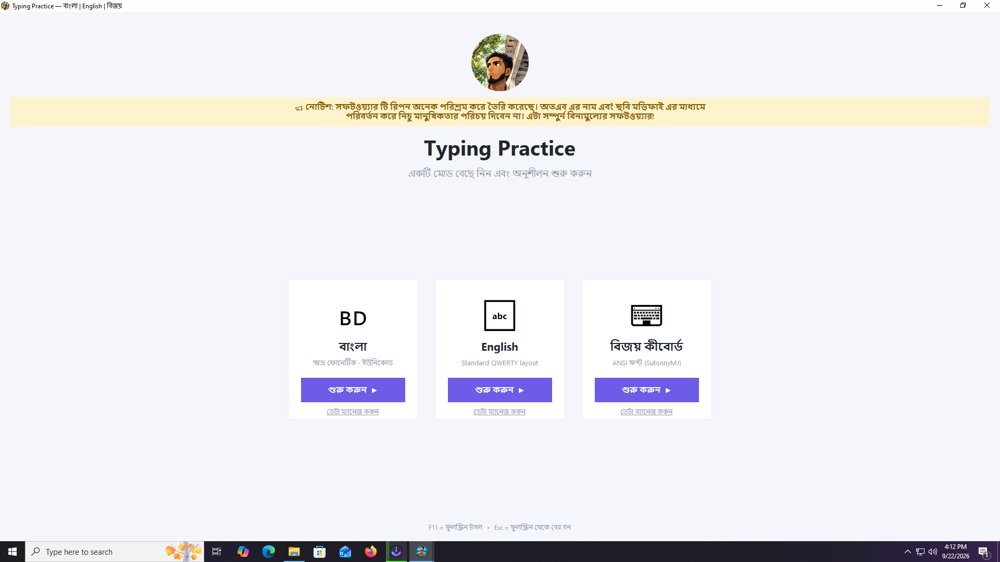
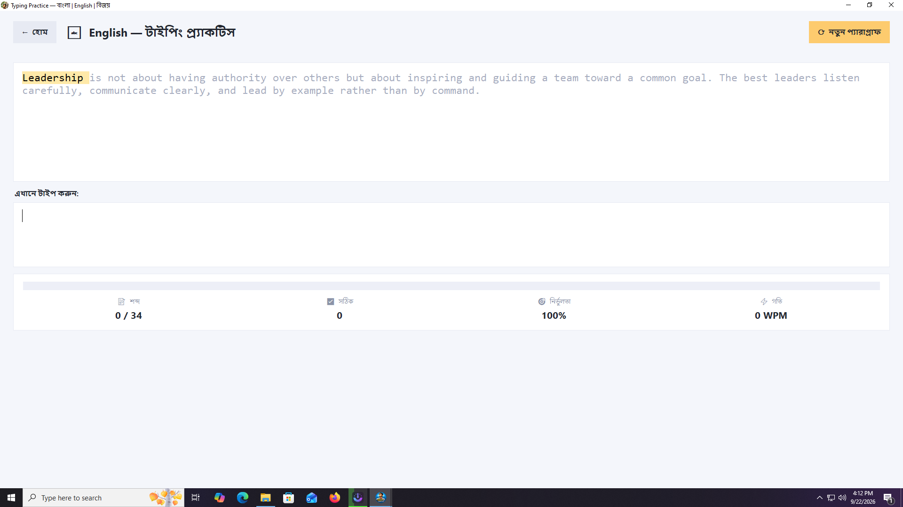
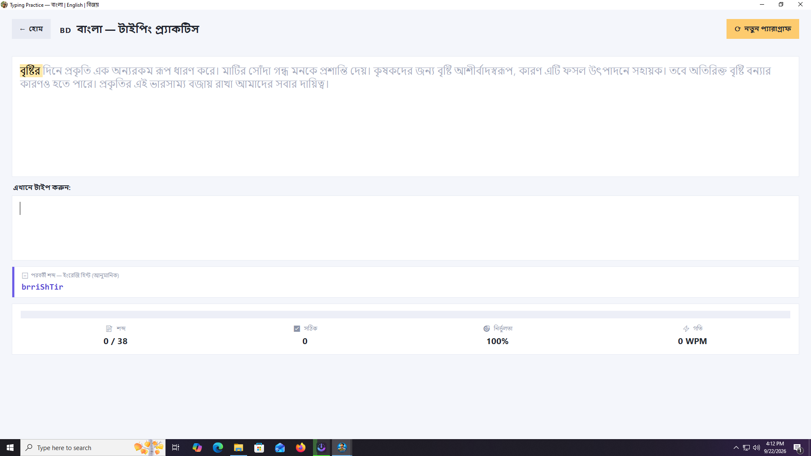

# ⌨️ Ripon Typing Tutor

### সহজে English, Avro ও Bijoy টাইপিং শিখুন

**Ripon Typing Tutor** হলো English, Avro এবং Bijoy টাইপিং শেখা ও নিয়মিত অনুশীলনের জন্য তৈরি একটি সহজ ও ব্যবহারবান্ধব Windows অ্যাপ।

নতুনদের জন্য সহজভাবে টাইপিং শেখা এবং নিয়মিত অনুশীলনের মাধ্যমে **টাইপিংয়ের গতি ও নির্ভুলতা বৃদ্ধি** করাই এই অ্যাপের মূল উদ্দেশ্য।

---

## 🎯 কী কী টাইপিং শিখতে পারবেন?

### 🇬🇧 English টাইপিং

সহজভাবে English টাইপিং শেখা ও অনুশীলন করুন।

* কীবোর্ডের সঠিক ব্যবহার শেখা
* বিভিন্ন শব্দ ও Paragraph টাইপ করার অনুশীলন
* টাইপিংয়ের গতি ও নির্ভুলতা বৃদ্ধি

### 🇧🇩 Avro টাইপিং

**Avro Phonetic** ব্যবহার করে সহজে বাংলা টাইপিং শিখুন।

* বাংলা শব্দ টাইপ করার অনুশীলন
* Avro-এর মাধ্যমে বাংলা টাইপিং শেখা
* নিয়মিত অনুশীলনের মাধ্যমে দক্ষতা বৃদ্ধি

### ⌨️ Bijoy টাইপিং

**Bijoy Keyboard** ব্যবহার করে বাংলা টাইপিং শেখা ও অনুশীলন করুন।

* Bijoy Keyboard-এর বিভিন্ন Key শেখা
* শব্দ ও Paragraph টাইপ করার অনুশীলন
* টাইপ করার সময় প্রয়োজনীয় Key Hint দেখা
* Bijoy টাইপিংয়ে দক্ষতা বৃদ্ধি

---

## 📥 অ্যাপটি ডাউনলোড করুন

Windows কম্পিউটারে ব্যবহার করার জন্য প্রস্তুত **EXE ফাইল** ডাউনলোড করুন।

### 💻 ব্যবহার করার নিয়ম

**১.** Download বাটনে ক্লিক করুন।

**২.** Download হওয়া `.exe` ফাইলটি চালু করুন।

**৩.** আপনার পছন্দের **English, Avro অথবা Bijoy** নির্বাচন করুন।

**৪.** স্ক্রিনে দেওয়া শব্দ বা Paragraph টাইপ করুন।

**৫.** নিয়মিত অনুশীলন করুন এবং আপনার টাইপিং দক্ষতা বাড়ান।

---

## 🎬 ডেমো ভিডিও

অ্যাপটি কীভাবে কাজ করে এবং কীভাবে টাইপিং অনুশীলন করতে হয় তা দেখতে ভিডিওটি দেখুন।

<a href="https://youtu.be/IcF5EvcVRps">
▶️ <b>ডেমো ভিডিও দেখতে এখানে ক্লিক করুন</b>
</a>

---

# 📸 Screenshots

## 🏠 Home

  

---

## 🇬🇧 English Typing

  

---

## 🇧🇩 Avro Typing

  

---

## ⌨️ Bijoy Typing

  

---
---

## 👨‍🎓 কারা ব্যবহার করতে পারবেন?

* 🎓 শিক্ষার্থী
* 💼 চাকরিপ্রার্থী
* 🧑‍💻 কম্পিউটার ব্যবহারকারী
* 🇧🇩 বাংলা টাইপিং শিখতে আগ্রহী ব্যক্তি
* 🇬🇧 English টাইপিং শিখতে আগ্রহী ব্যক্তি
* ⌨️ Avro ও Bijoy শিখতে আগ্রহী যে কেউ

---

## ⭐ আজ থেকেই টাইপিং শেখা শুরু করুন

**English → Avro → Bijoy**

নিয়মিত অনুশীলন করুন, টাইপিংয়ের গতি ও নির্ভুলতা বাড়ান।

### ⌨️ শিখুন • অনুশীলন করুন • দক্ষ হয়ে উঠুন

### ❤️ Happy Typing!

